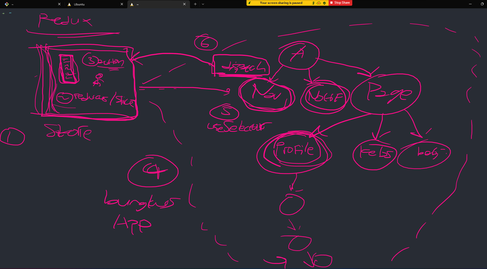

1. Membuat store dan koneksikan ke aplikasi react kita
   - Import provider dari react redux dan masukan store ke dalam provider
   - Membuat store dengan menggunakan configure store
   - import store masuk ke provider

2. Buat komponen view dan slice
   - View hanya berisi teks aja
   - BooksSlice berisi createSlice untuk reducer yang dikirim ke store
   - Store menerima createSlice dari BooksSlice

3. Memunculkan state dari store redux
   - Menggunakan useSelector dalam komponen view

4. Mengubah state dari store redux menggunakan action
   - Export action dari bookSlice
   - Buat button untuk melakukan useDispatch action

---

1. buat store (gudang penyimpanan)
2. buat reducer/slice (rak barang)
3. buat action (kamampuan untuk mengubah barang)
4. bungkus app (gudang siap diakses)
5. data siap diambil pakai useSelector
6. kalau mau ubah data, pakai dispatch (surat jalan)

